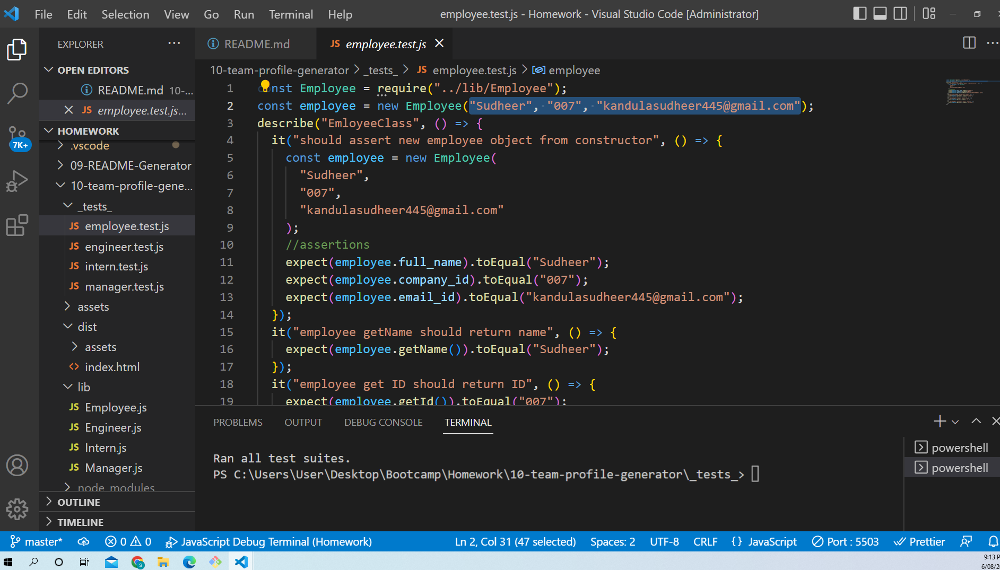

# 10-team-profile-generator
## User story
AS A manager
I WANT to generate a webpage that displays my team's basic info
SO THAT I have quick access to their emails and GitHub profiles

## Decsription of the project
GIVEN a command-line application that accepts user input
WHEN I am prompted for my team members and their information
THEN an HTML file is generated that displays a nicely formatted team roster based on user input
WHEN I click on an email address in the HTML
THEN my default email program opens and populates the TO field of the email with the address
WHEN I click on the GitHub username
THEN that GitHub profile opens in a new tab
WHEN I start the application
THEN I am prompted to enter the team manager’s name, employee ID, email address, and office number
WHEN I enter the team manager’s name, employee ID, email address, and office number
THEN I am presented with a menu with the option to add an engineer or an intern or to finish building my team
WHEN I select the engineer option
THEN I am prompted to enter the engineer’s name, ID, email, and GitHub username, and I am taken back to the menu
WHEN I select the intern option
THEN I am prompted to enter the intern’s name, ID, email, and school, and I am taken back to the menu
WHEN I decide to finish building my team
THEN I exit the application, and the HTML is generated

#Deployment
[Github repo] sudheer313/10-team-profile-generator  
[Github URL here] https://github.com/sudheer313/10-team-profile-generator 
[Live webpage URL](https://sudheer313.github.io/10-team-profile-generator/) 
[screencastify link] (https://drive.google.com/file/d/1K3EWV5uIfcL-f1l-WTFG1Sb0kVLzsO43/view)

### Test cases
*demo of Test cases

### 

## Built with

- node js
- npm installer 8.0
- Jest to test files
- Bootstrap. 

## Features
It lets user to save employee details like Enginer and intern and also their corresponding details

## Credits
1. referred jessamyn27/Team-Profile-Generator-JS-Node-Jest
2. Ask BCS 
3. referred  ashachakre0906/Work-Day-Planner repository
4. https://www.npmjs.com/package/inquirer
repository
5. [Bootstrapdocs]https://getbootstrap.com/docs/5.2/getting-started/introduction/
6. https://developer.mozilla.org/en-US/docs/Web/JavaScript/Guide/Modules

## What we learned
I learned few important stuff regarding Jest and unit testing. I also got hands on practice with Oops, classes and most importantly using node.js.
I became more familiar with node, Unit testing and Oops classes most importantly. This assignmnet help me to get experiance with Node, unit testing, Jest tsting

## Challenges
I had no clue how to create classes and do unit testing at first. But when I referred to class tutorials and Jest docs helped me through. I also had a bit trouble to understand the use of classes and exporitng them as modules and using them in inquirer. But after referring  jessamyn27 github repo and understanging the basic concept of inquirer using inquirer like we did in last assignmnet I managed to overcome this challange and very thankful for ASK Bcs who always assisted me throgh out the process. I also thank jessamyn27 and ashachakre0906.
I am also thankful and proud of myself for not giving up and keep trying untill I managed to learn this.
## Author

@Sudheer kandula
